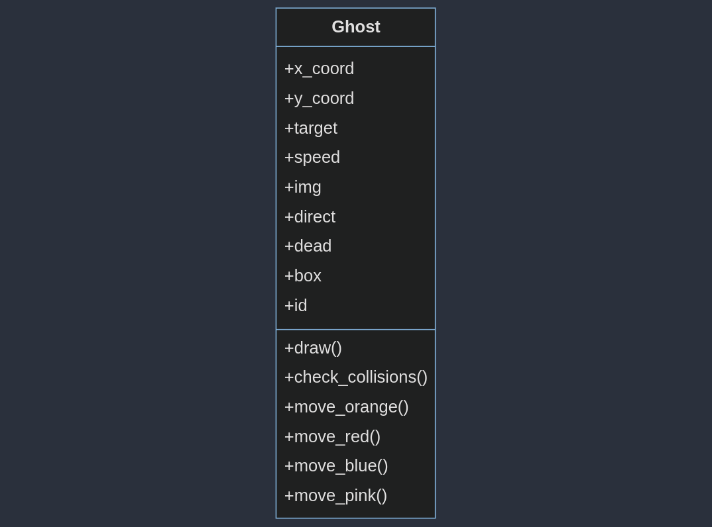

# Структурные модели

## Class Ghost

### Структура данных Ghost
Эта структура данных представляет привидение в игре. Она используется для управления движением, отрисовкой и обработкой столкновений привидения с объектами на игровом поле. Призрак имеет свойства скорости `speed`, `img` поверхность, которая отображает внешний вид привидения, направление движения `direct`, жив или мертв призрак `dead`, находится ли он в стартовой коробке `box`
